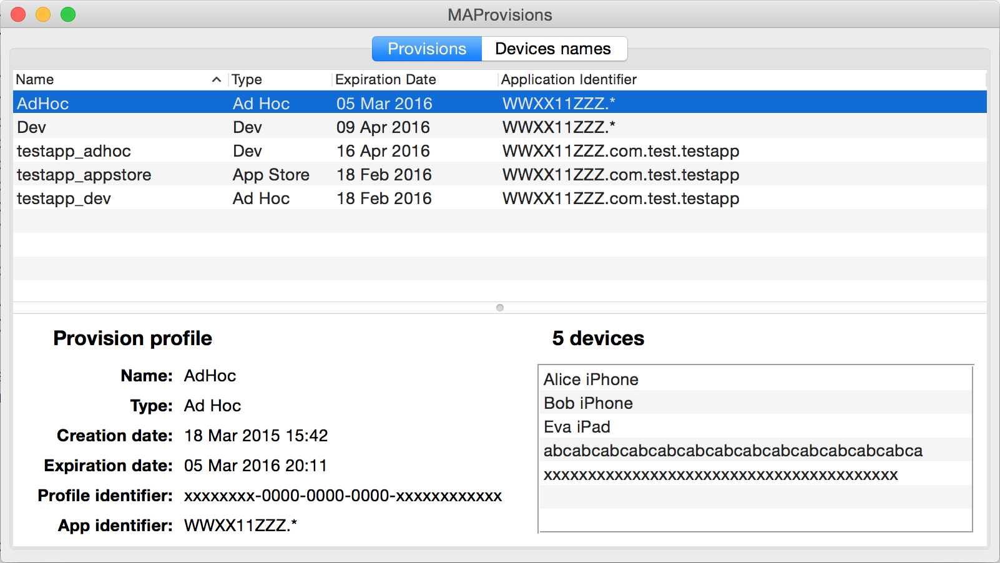

# MAProvisions
Small OS X application for developers that helps working with provisions.

* view all provision profiles installed on your computer
* select any profile and see its information including devices list
* you can add names for your devices UDIDs and your name will be shown in devices list of provision
* you can delete provision by right-click on it and select corresponding command in context menu 

# License
Permission is granted to anyone to use this software for any purpose, including commercial applications

# Contact
Suggestions will be well received

Mail [pigmasha@gmail.com](mailto:pigmasha@gmail.com)
